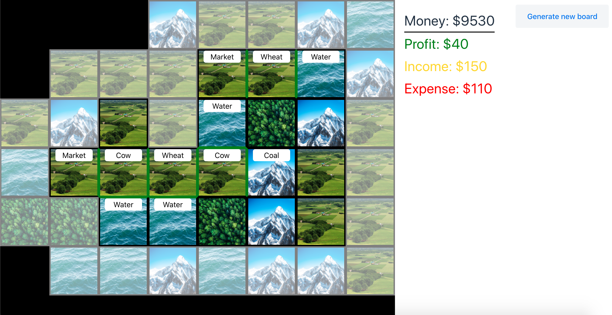
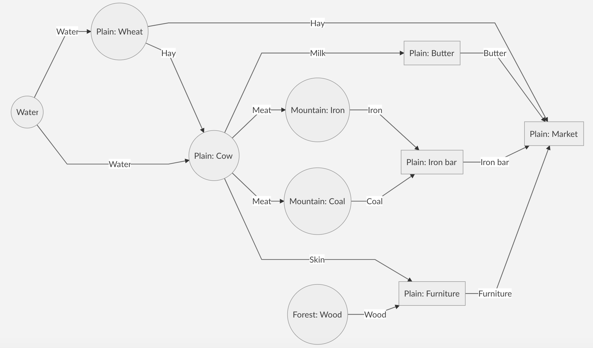
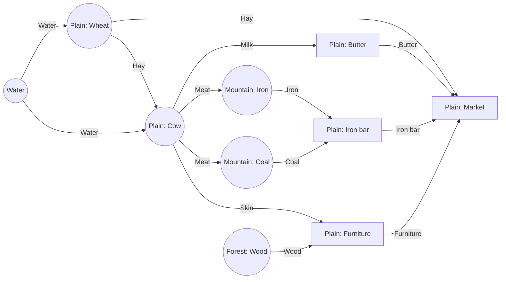

# Square Tycoon

Web strategy game build with using Vaadin framework.



## Inspirations
- Settlers
- Civilization IV

## Technologies
- Java 11
- Vaadin 14

## Features
- Board is build with fields
- 4 types of the fields and what providing:
	- water: of course water
	- plain: animals, farms, manufacturers and market
	- forest: wood
	- mountain: coal and iron
- Random generated fields. Default settings:
    - water: 20%
    - plain: 50%
    - forest: 10%
    - mountain: 20%
- Possible to buy field
- All fields are not visible for end-user except middle part of the board and 1 field around middle part (dimmed)
- A dimmed field can be bought by end-user
- Each field generates cost and some fields generate income when they have all require products and connected with market
- If field can provide products, the border between fields will change to be green colour
- Possible to configure below settings (config.yaml):
    - size of the board
    - available money at the beginning
    - increase price of fields to buy
    - percent of generated terrain types
    - debugging option to show all fields
	
## Diagram of connections


Generated with using Mermaid: https://mermaid-js.github.io/mermaid/#/
<details><summary>Click to display code for diagram</summary>
<p>


</p>
</details>

## Run application
```
mvn clean package tomee:run
```

